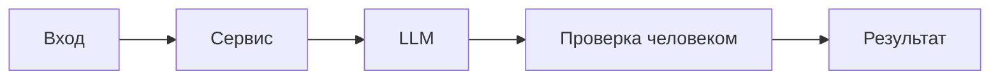

# ADR: решение для первого рабочего сценария

- Статус: proposed
- Дата: 2026-09-17
- Ответственные: не указано (нет в TRAINING_PR.diff)

## Контекст

PR добавляет метод `ReviewService.review(diff: str)` и HTTP-эндпоинт `POST /api/reviews`.

- Формирование промпта и делегирование в LLM: app/review_service.py:19-22 в TRAINING_PR.diff.
- Эндпоинт принимает JSON и обращается к `payload["diff"]`: app/api.py:35-37 в TRAINING_PR.diff.
- Протокол LLM определяет метод `generate(self, prompt: str) -> str`: app/review_service.py:9-13 в TRAINING_PR.diff.

## Решение

Реализован сервисный метод, который строит промпт вида:

"Review this pull request and find problems:\n{diff}" — передаёт его в `llm.generate` и возвращает ответ в виде словаря `{ "comment": <строка> }`. Источник: app/review_service.py:19-22 в TRAINING_PR.diff.

Добавлен эндпоинт `POST /api/reviews`, который принимает тело запроса как словарь и передаёт поле `diff` в `review_service.review(...)`. Источник: app/api.py:35-37 в TRAINING_PR.diff.

## Рассмотренные альтернативы

| Альтернатива | Почему не выбрали сейчас |
|---|---|
| Валидация входа через Pydantic-модель | Отсутствует в этом PR (не реализовано; источник: прямой доступ к `payload["diff"]` в app/api.py:37) |
| Обработка ошибок/таймаутов LLM | Отсутствует в этом PR (не реализовано; источник: прямой вызов `llm.generate` без try/except в app/review_service.py:21) |

## Последствия и главный риск

- Положительные последствия:
  - Появился явный HTTP-эндпоинт для запуска ревью по диффу. Источник: app/api.py:35-37 в TRAINING_PR.diff.
  - Единая схема ответа `{"comment": str}`. Источник: app/review_service.py:21-22 в TRAINING_PR.diff.
- Ограничения:
  - Нет валидации тела запроса и обязательного поля `diff`. Источник: app/api.py:37 в TRAINING_PR.diff.
  - Нет обработки ошибок LLM и ограничения размера входа (внутри данного PR не предусмотрено). Источник: app/review_service.py:19-22 в TRAINING_PR.diff.
- Главный риск:
  - `KeyError` и 500 при отсутствии поля `diff` в теле запроса. Источник: app/api.py:37 в TRAINING_PR.diff.
- Как проверим риск:
  - Негативный E2E-тест: отправить `{}` на `POST /api/reviews` и зафиксировать 500/исключение. Evidence: app/api.py:37 в TRAINING_PR.diff.

## Архитектурная схема

## Как использовали AI

- Для чего:
- Тип промпта:
- Строка в [`prompts.md`](prompts.md):
- Что проверили и исправили сами:
