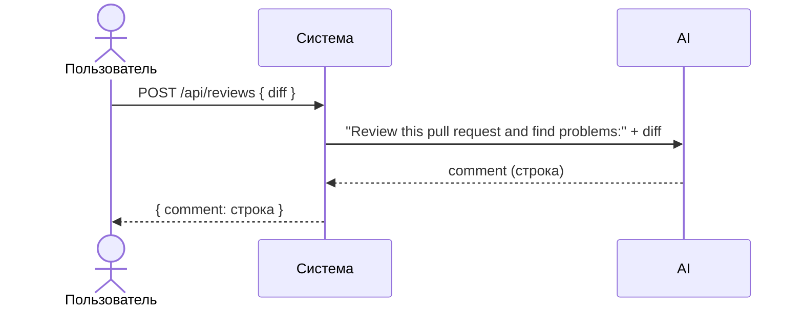

# Use cases и user stories

## Первый рабочий сценарий

**Когда** клиент отправляет POST /api/reviews с JSON, содержащим ключ "diff", **система** формирует промпт "Review this pull request and find problems:\n{diff}", вызывает LLM и **а пользователь получает** JSON-ответ вида {"comment": "<строка>"}.

Не входит в этот сценарий:

- Аутентификация и авторизация.
- Валидация тела запроса и обработка ошибок.
- Ограничения на размер diff и таймауты LLM.
- Расширение структуры ответа сверх {"comment": str}.

## Use case

| Поле | Значение |
|---|---|
| Актор | Клиент API |
| Триггер | Отправляет POST /api/reviews с JSON, содержащим ключ "diff" |
| Предусловия | Эндпоинт доступен; тело запроса содержит ключ "diff" |
| Основной результат | Возвращён JSON с ключом "comment" (строка ответа LLM) |
| Ошибка или отказ | При отсутствии ключа "diff" возникает ошибка (KeyError в текущей реализации) |



## User stories и acceptance criteria

```gherkin
Feature: Ревью диффа PR

  Scenario: Позитивный
    Given API доступно
    When клиент отправляет POST /api/reviews с телом {"diff": "..."}
    Then ответ содержит ключ "comment" со строковым значением

  Scenario: Негативный
    Given API доступно
    When клиент отправляет POST /api/reviews с пустым телом {}
    Then возникает ошибка из-за отсутствия поля "diff" (текущая реализация)
```

## Как использовали AI

- Для чего: анализ TRAINING_PR.diff и заполнение use cases и acceptance criteria по фактам.
- Тип промпта: master prompt.
- Строка в [`prompts.md`](prompts.md): P1-03.
- Что проверили и исправили сами: сопоставление поведения API и сервиса с строками диффа; фикс риска отсутствующего поля "diff".
