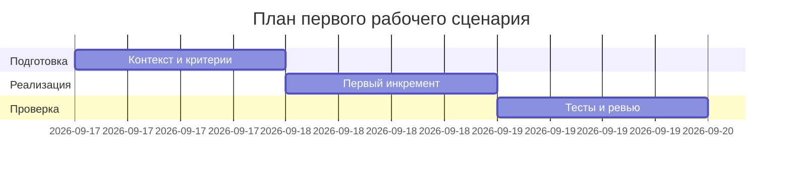

# План поставки

## Инкременты и ответственность

| Инкремент | Наблюдаемый результат | Что делает человек | Что делает AI или субагент | Проверка | Зависимости |
|---|---|---|---|---|---|
| 1 | Определён контракт API и риски | Формулирует критерии и риски | Извлекает факты из TRAINING_PR.diff | Ссылки на строки diff в prompts.md | TRAINING_PR.diff: app/api.py, app/review_service.py |
| 2 | Подготовлены тестовые сценарии | Уточняет сценарии | Генерирует таблицы E2E/интеграция/нагрузка/unit | Маркеры Evidence со ссылками на строки diff | Инкремент 1 |
| 3 | Документы ADR и анализ процесса | Проверяет соответствие формату | Заполняет ADR и analysis по фактам diff | Peer review ссылок и формата | Инкременты 1-2 |

## Диаграмма Ганта

Замените даты и задачи на свой план.

## Как использовали AI

- Для чего:
  - Составление плана поставки по фактам из TRAINING_PR.diff.
- Тип промпта:
  - Master prompt.
- Строка в [`prompts.md`](prompts.md):
  - P1-03.
- Что проверили и исправили сами:
  - Выравнивание задач с ограничениями диффа; проверка ссылок на строки diff.
